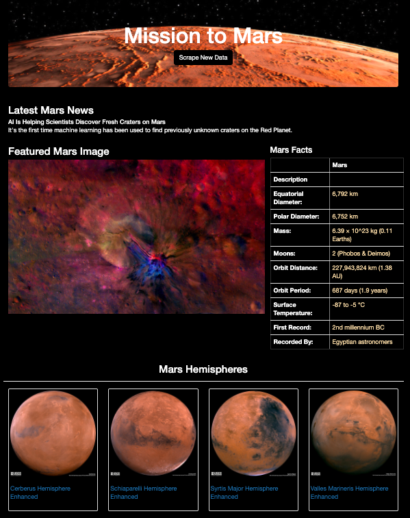

# Mission-to-Mars

## Overview
Create a web application with Flask that will scrape different websites to extract data about the Mission to Mars, store it into a NoSQL database, and then display the latest information on an HTML page.

## Resources
- Data Sources: 
    [Mars News](https://mars.nasa.gov/news/), [Mars Featured Images](https://www.jpl.nasa.gov/spaceimages/?search=&category=Mars), [Mars Facts](http://space-facts.com/mars/), [Mars Hemispheres](https://astrogeology.usgs.gov/search/results?q=hemisphere+enhanced&k1=target&v1=Mars)
- Tech Used: Python, Anaconda, Conda, Jupyter Notebook, MongoDB, Splinter, BeautifulSoup, Flask, BootStrap

## Webpage:

